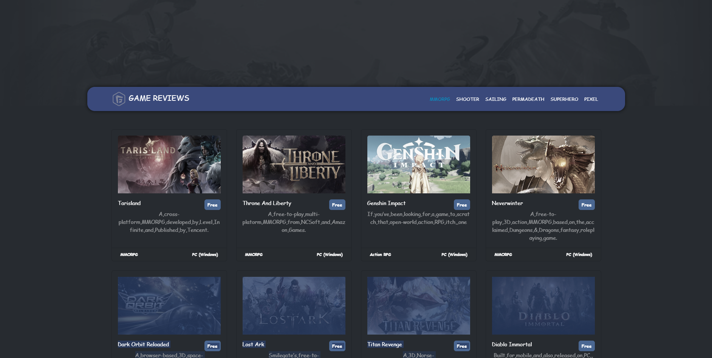

# GameOOP - Free Games Explorer



## Overview

GameOOP is a web application that allows users to browse and explore
free-to-play games across different categories. The application fetches data
from the Free-to-Play Games Database API and displays it in an interactive
interface.

## Features

- Browse games by categories (MMORPG, Shooter, Sailing, Permadeath, Superhero,
  Pixel)
- View detailed information about each game
- Responsive design that works on desktop and mobile devices
- Game screenshots gallery in the details view
- Direct links to play the games

## Technologies Used

- HTML5
- CSS3
- JavaScript (ES6+)
- Bootstrap 5
- Font Awesome
- Object-Oriented Programming principles
- Async/Await for API calls
- RapidAPI (Free-to-Play Games Database)

## Project Structure

The project follows an object-oriented approach with the following main classes:

- `Games`: Handles fetching and displaying the list of games
- `Details`: Manages the detailed view of a selected game
- `Ui`: Responsible for rendering the UI components

## Setup and Installation

1. Clone the repository:

```bash
git clone https://github.com/Ziad-Nasser/GameOOP.git
```
